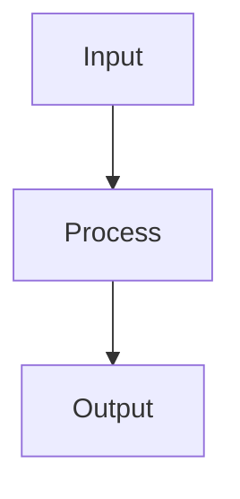

# Explain

Provide a clear, multi-level explanation of the specified code or concept.

## Instructions

Use `$ARGUMENTS` to identify what to explain (file, function, concept, or architecture).

### Level 1: Quick Summary (ELI5)
- One paragraph, plain language
- What does this do and why does it exist?
- Analogy if helpful

### Level 2: Technical Explanation
- How it works step by step
- Key data structures and algorithms
- Inputs, outputs, and side effects
- Dependencies and interactions with other components

### Level 3: Deep Dive
- Implementation details and design decisions
- Edge cases and error handling
- Performance characteristics
- Potential improvements or known limitations
- Historical context (why was it built this way?)

### Diagrams
If the subject involves data flow, state machines, or component relationships, include a Mermaid diagram:

Output all three levels in a single response. The reader can stop at any level they find sufficient.
